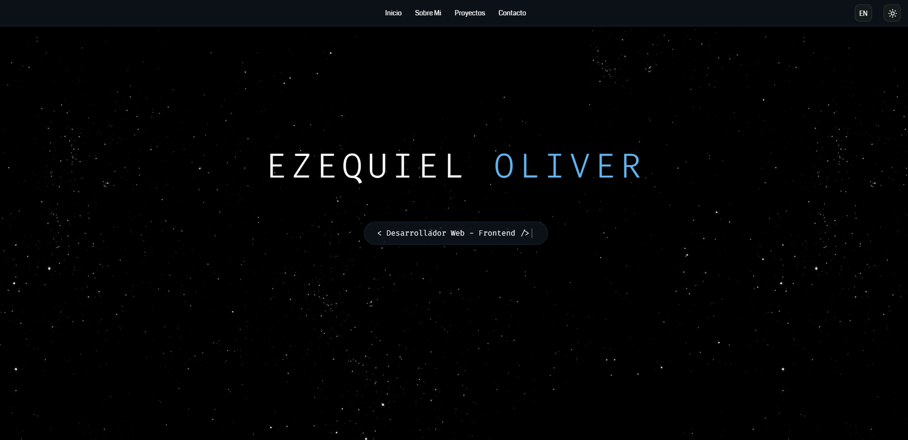
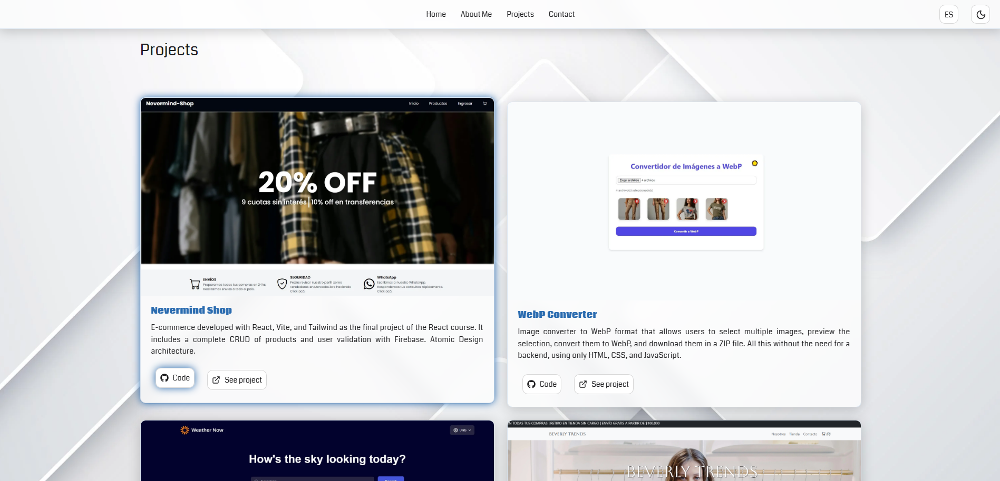

# Portfolio Personal

Portfolio web profesional y responsivo que muestra mis proyectos como desarrollador web. El sitio cuenta con modo oscuro/claro, soporte multiidioma y efectos visuales interactivos. Esta versión ha sido modernizada y refactorizada completamente utilizando **React, TypeScript y Tailwind CSS**.

## 🖼️ Capturas de Pantalla






## 🚀 Características

- **Diseño Responsivo**: Adaptable a todas las pantallas y dispositivos.
- **Modo Oscuro/Claro**: Cambio de tema visual dinámico según preferencia del usuario.
- **Multiidioma (i18n)**: Soporte completo para español e inglés manejado vía Context API.
- **Animaciones y Efectos Visuales**: Transiciones fluidas, aparición al hacer scroll (Framer Motion) y un efecto inmersivo de profundidad (Parallax) en el fondo oscuro.
- **Efecto de Escritura**: Texto dinámico y llamativo en la cabecera.
- **Formulario de Contacto**: Integrado dinámicamente con validaciones.
- **Arquitectura Escalable**: Estructura basada en Atomic Design (Atoms, Molecules, Organisms).

## 🛠️ Tecnologías Utilizadas

- **React 19:** Biblioteca principal para la construcción de interfaces de usuario.
- **TypeScript:** Tipado estático para un código más robusto y predecible.
- **Vite:** Herramienta de construcción (bundler) ultrarrápida.
- **Tailwind CSS v4:** Framework de CSS utilitario para un diseño rápido y flexible.
- **Framer Motion:** Biblioteca líder en React para animaciones y gestos.
- **Lucide React:** Iconografía moderna y escalable.
- **Typewriter Effect:** Efecto dinámico de escritura.

## 📥 Instalación y Desarrollo Local

1. Clona el repositorio:
```bash
git clone https://github.com/Oliver-92/Portafolio-React.git
```

2. Navega al directorio del proyecto:
```bash
cd portafolio-react
```

3. Instala las dependencias:
```bash
npm install
```

4. Ejecuta el servidor de desarrollo:
```bash
npm run dev
```

5. Construye la versión de producción:
```bash
npm run build
```

## 📱 Estructura del Proyecto

La aplicación utiliza la metodología **Atomic Design** para organizar los componentes de React:

```text
portafolio-react/
├── public/              # Archivos estáticos
├── src/                 # Código fuente
│   ├── assets/          # Imágenes y recursos multimedia
│   ├── components/      # Componentes UI
│   │   ├── atoms/       # Componentes más pequeños (Botones, Iconos, Inputs)
│   │   ├── molecules/   # Agrupación de átomos (Formularios, Tarjetas, Toggles)
│   │   └── organisms/   # Componentes complejos y secciones enteras (Header, Hero, About, Projects)
│   ├── context/         # Estado global (Ej. LanguageProvider, ThemeProvider)
│   ├── utils/           # Datos estáticos, traducciones y funciones de utilidad
│   ├── App.tsx          # Componente raíz
│   ├── main.tsx         # Punto de entrada de la aplicación
│   └── styles.css       # Estilos globales y variables de tema
├── tailwind.config.ts   # Configuración de Tailwind CSS
└── vite.config.ts       # Configuración de Vite
```

## ⚡ Optimizaciones

- Renderizado ultra-rápido impulsado por **Vite** y el nuevo **React Compiler**.
- Imágenes optimizadas en formato WebP con atributos de lazy-loading y dimensiones explícitas.
- Tipado estricto con TypeScript para evitar errores en tiempo de ejecución.
- Modularización de componentes para máxima reutilización de código.

## 📄 Licencia

Este proyecto está bajo la Licencia MIT.

## 👤 Autor

**Ezequiel Oliver**
- GitHub: [@Oliver-92](https://github.com/Oliver-92)
- LinkedIn: [Ezequiel Oliver](https://www.linkedin.com/in/ezequiel-oliver/)
- Email: ezequiel.oliver@live.com.ar

## ✨ Agradecimientos

- [Framer Motion](https://www.framer.com/motion/) por su motor de animaciones increíble.
- [Typewriter Effect](https://github.com/tameemsafi/typewriterjs) por los efectos de escritura.
- [Shields.io](https://shields.io/) por los badges de tecnologías.
- [Fontsource](https://fontsource.org/) por la provisión eficiente de tipografías.
- [Lucide React](https://lucide.dev/) por la librería de íconos hermosos y ligeros.
- [Freepik](https://www.freepik.es/) por las imágenes utilizadas (Background light mode).
