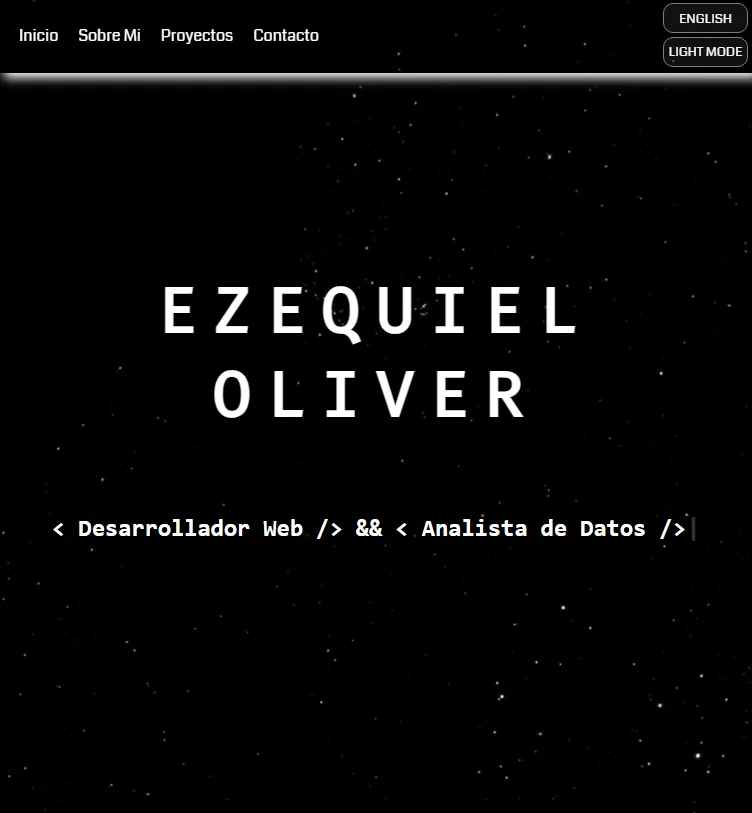

# Portfolio Personal

Portfolio web profesional y responsivo que muestra mis proyectos como desarrollador web y analista de datos. El sitio cuenta con modo oscuro/claro, soporte multiidioma y efectos visuales interactivos.

<p align="center">
  
</p>


## 🚀 Características

- **Diseño Responsivo**: Adaptable a todas las pantallas y dispositivos
- **Modo Oscuro/Claro**: Cambio de tema visual según preferencia del usuario
- **Multiidioma**: Soporte para español e inglés
- **Efectos Visuales**: Animaciones suaves y efectos interactivos
- **Formulario de contacto dinámico:** Envía los datos sin recargar la página, mostrando un mensaje de éxito en el idioma configurado.
- **Secciones Organizadas**: 
  - Página de inicio con efecto de escritura
  - Sobre mí con habilidades técnicas
  - Portafolio de proyectos filtrable
  - Formulario de contacto

## 🛠️ Tecnologías Utilizadas

- **HTML5:** Estructuración del contenido del sitio.
- **CSS3:** Diseño visual (Variables CSS, Flexbox, Animaciones)
- **JavaScript (Vanilla):** Funcionalidad dinámica, como validaciones, animaciones y manejo del envío de formularios.
- **GitHub Pages:** Hosting del proyecto.
- [Typewriter Effect](https://github.com/tameemsafi/typewriterjs)

## 📥 Instalación

1. Clona el repositorio:
```bash
git clone https://github.com/Oliver-92/Portafolio.git
```

2. Navega al directorio del proyecto:
```bash
cd portfolio
```

3. Abre `index.html` en tu navegador o usa un servidor local:
```bash
# Si tienes Python instalado
python -m http.server 8000

# Si tienes Node.js instalado
npx serve
```

## 🎨 Personalización

### Modificar el Tema

Los colores y estilos del tema se pueden modificar en `css/styles.css`:

```css
:root {
    --background-image: rgb(0, 0, 0) url("../img/stars01.png");
    --primary-color: rgb(255, 255, 255);
    /* ... más variables CSS ... */
}
```

### Cambiar el Contenido

1. **Proyectos**: Edita la sección de proyectos en `index.html`:
```html

    Título del Proyecto
    
    Descripción del proyecto
    

```

2. **Traducciones**: Modifica los textos en `js/translations.js`:
```javascript
const translations = {
    es: {
        // Textos en español
    },
    en: {
        // Textos en inglés
    }
}
```

## 📱 Estructura de Archivos

```
portfolio/
├── index.html           # Página principal del portafolio
├── css/
│   └── styles.css       # Estilos principales del sitio
├── js/
│   ├── form.js          # Gestión del formulario
│   ├── script.js        # Funcionalidad del sitio
│   ├── translations.js  # Traducciones del sitio
│   ├── language.js      # Funciones de cambio de idioma
│   └── theme.js         # Funciones de cambio de tema
└── img/
    └── ...
```

## ⚡ Optimizaciones Realizadas

- Imágenes optimizadas en formato WebP
- CSS y JavaScript minificados
- Lazy loading de imágenes
- Fuentes optimizadas con `font-display: swap`
- Assets precargados críticos

## 🌐 SEO y Accesibilidad

- Estructura HTML semántica
- Meta tags optimizados
- Textos alternativos en imágenes

## 📄 Licencia

Este proyecto está bajo la Licencia MIT - ver el archivo [LICENSE.md](LICENSE.md) para más detalles.

## 👤 Autor

Ezequiel Oliver
- GitHub: [@Oliver-92](https://github.com/Oliver-92)
- LinkedIn: [Ezequiel Oliver](https://www.linkedin.com/in/ezequiel-oliver/)
- Email: ezequiel.oliver@live.com.ar

## 🤝 Contribuciones

Las contribuciones son bienvenidas. Para cambios importantes, por favor abre un issue primero para discutir qué te gustaría cambiar.

## ✨ Agradecimientos

- [Typewriter Effect](https://github.com/tameemsafi/typewriterjs) por los efectos de escritura
- [Shields.io](https://shields.io/) por los badges de tecnologías
- [Google Fonts](https://fonts.google.com/) por las fuentes utilizadas
- [Freepik](https://www.freepik.es/) por las imágenes utilizadas (Background light mode)
- [Formspree](https://formspree.io/) por el servicio de correo electrónico para el formulario de contacto

---
⭐️ Si te gusta este proyecto, ¡no dudes en darle una estrella!
